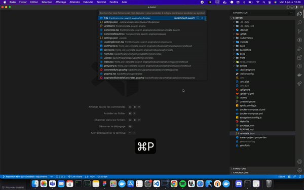
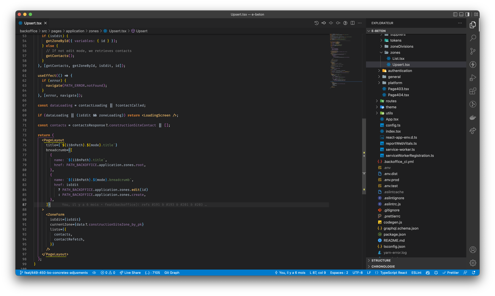
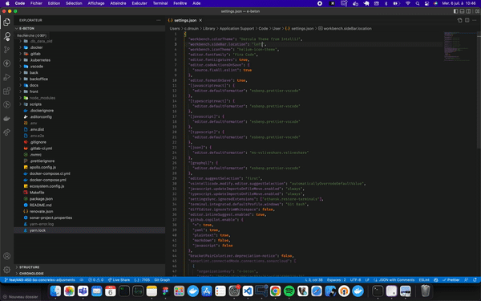
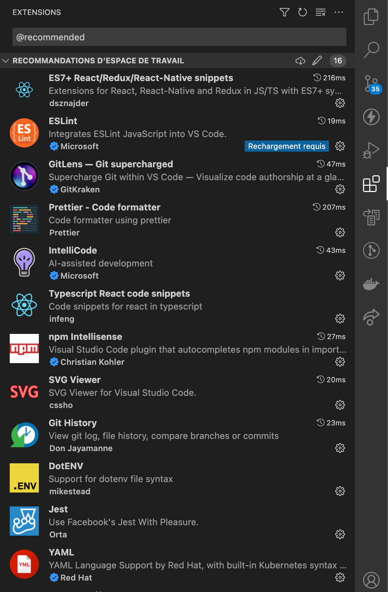
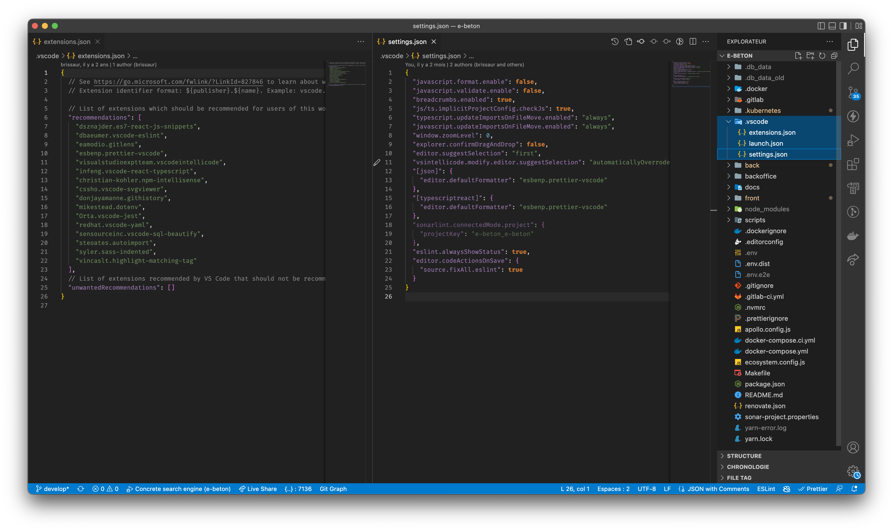

Il est fort probable que vous utilisiez ou que vous connaissiez quelqu'un qui utilise Visual Studio Code. Le but de cet article sera d'aborder des **tips** sur l'outil. On parlera de choses basiques, mais aussi un peu plus avancées, toujours dans l'idée de rendre le développement plus confortable mais aussi plus productif.

Si vous ne connaissez malheureusement pas ce superbe IDE, je vous recommande cette [vidéo](https://www.youtube.com/watch?v=KMxo3T_MTvY&ab_channel=Fireship) de Fireship (au passage, abonnez-vous, son contenu est incroyable).


# Raccourcis 

Le classique `Ctrl + Space` (`Cmd + Esc` sur mac) permet de faire de la suggestion sur votre instruction courrante, sans avoir à l'effacer puis la réécrire.

Pour changer de fichier rapidement, utilisez `Ctrl + P` (ou `Cmd + P` sur Mac), et tapez un nom de fichier.


Rajouter `Shift` à l'instruction précédente permet d'exécuter des commandes (ex: Restart TypeScript Server), mais surtout d'accéder à des paramètres sans avoir à naviguer dans les multiples onglets.

<figure>
    
    <center><caption>Ctrl + P et Ctrl + Shift + P<caption></center>
</figure>

Avec `Ctrl + Shift + [UP/DOWN]` (`Cmd + Option + [UP/DOWN]` sur Mac), vous pouvez activer le multi-curseur. Cela permet d'écrire le même contenu en même temps sur plusieurs lignes. 

Après avoir surligné un pattern, chaque utilisation de `Ctrl + D` (`Cmd + D` sur Mac) vous permettra d'ajouter à la sélection la prochaine occurrence de ce même pattern, et donc de l'éditer en même temps ! 

# Configuration de base

## Theme, icônes et police

Quand on installe Visual Studio Code, la première chose qui saute aux yeux, c'est l'absence d'icônes dans l'arborescence de fichier (surtout si vous utilisez couramment les outils de JetBrains).

Il existe différentes extensions pour les icônes. A titre personnel, j'utilise **Helium Icon Theme** (mettre le lien ?). Sinon, vous avez **vscode-icons** (mettre e lien aussi ?) qui est le plus connu et très apprécié de la communauté.

Pour le thème, c'est vraiment selon votre choix ! Il en existe des centaines : light, dark, inspiré de GitHub, de intellij ou encore custom... Bref il y en a pour tous les goûts !

D'ailleurs, vous pouvez noter que la modification du thème et des icônes se fait rapidement avec le shortcut `Ctrl + Shift + P` dont je vous parlais plus haut ! 

Pour la police de caractère, c'est aussi à la carte ! J'utilise depuis plus d'un an **[Fira Code](https://github.com/tonsky/FiraCode)** qui rajoute un petit quelque chose grâce a ses ligatures. Pour l'installer, il y a une [page](https://github.com/tonsky/FiraCode/wiki) dédiée sur leur GitHub, avec des instructions selon l'OS mais aussi selon l'IDE !

<figure>
    
    <center><caption>Helium Icons + Darcula Theme from IntelliJ + Fira Code<caption></center>
</figure>


## Extensions

Il n'y a pas vraiment d'extensions "must have". Cela dépend de votre stack technique, de vos besoins et de vos habitudes. 

Néanmoins, on retrouve souvent les mêmes : eslint, prettier, auto import, import cost, git lens...

Cette liste n'est évidemment pas exhaustive ! Il existe énormément de vidéos [YouTube](https://www.youtube.com/watch?v=sS8DWRQ_tao&ab_channel=EngineeringwithUtsav), d'articles Medium et autres qui présentent des extensions VS Code.

Je voudrais cependant vous faire découvrir quelques extensions que j'affectionne particulièrement :

- **Git Graph**: pour visualiser son graphe git et agir dessus ;
- **Thunder Client**: un Postman-like embarqué dans VS Code ;
- **Color Highlight**: pour surligner les couleurs webs (Hex, rbg, basic...) ;
- **Live Share**: Pour se connecter en remote au workspace de quelqu'un, très utile pour du peer-programming notamment.

## Fichier settings.json

Avec `Ctrl + Shift + P`, on peut accéder au fichier `settings.json`. Il s'agit du fichier contenant vos paramètres utilisateurs. Vous pouvez y retrouver notamment les paramètres lié à l'UI dont je parlais plus haut.

C'est dans ce fichier qu'on indique la configuration pour eslint, les formateurs par défaut selon le type d'extensions. On peut aussi y indiquer un terminal par défaut. Par exemple, sur windows, j'utilise :

```json
"terminal.integrated.defaultProfile.windows": "Git Bash"
```
pour forcer l'utilisation de Git Bash.

Je vous recommande aussi 
```json
"workbench.sideBar.location": "right"
```
qui permet de mettre la sidebar sur la droite. Au début, ça peut sembler contre intuitif, mais cela permet au code de ne pas bouger lorsque l'on ouvre, ferme ou redimensionne la fenêtre.

<figure>
    
    <center><caption>Sidebar à droite vs à gauche<caption></center>
</figure>

On peut aussi configurer vscode afin qu'il formatte le fichier et fix les erreurs eslint "basiques". Pour cela vous pouvez utiliser une configuration proche de la suivante : 

```json
  "editor.codeActionsOnSave": {
    "source.fixAll.eslint": true
  },
  "editor.formatOnSave": true,
  "[javascriptreact]": {
    "editor.defaultFormatter": "esbenp.prettier-vscode"
  },
  "[typescriptreact]": {
    "editor.defaultFormatter": "esbenp.prettier-vscode"
  },
  "[javascript]": {
    "editor.defaultFormatter": "esbenp.prettier-vscode"
  },
  "[typescript]": {
    "editor.defaultFormatter": "esbenp.prettier-vscode"
  },
  "[json]": {
    "editor.defaultFormatter": "ms-vsliveshare.vsliveshare"
  },
  "[graphql]": {
    "editor.defaultFormatter": "esbenp.prettier-vscode"
  },
```

J'ai défini un formatter selon le type de fichier. Vous pouvez faire de même en fonction de vos languages et extensions utilisées au quotidien !


# Configuration avancée

## Synchronisation

En entreprise, et plus particulièrement en ESN, on peut être amené à changer souvent de PC : nouveau matériel, nouveau client, nouveau projet... 

Il existe plein de solutions permettant d'éviter de réinstaller l'ensemble de sa configuration. VS Code propose une feature de [synchronisation](https://code.visualstudio.com/docs/editor/settings-sync) via un compte Microsoft ou GitHub. Elle comprend vos paramètres, shortcuts, snippets, extensions et configurations d'interface. Chacun de ces éléments peut être synchronisé ou non.

Ainsi, vous pouvez récupérer la configuration de votre poste, même celle de votre poste personnel !

## Workspace configuration

Dans un projet, une différence de configuration entre deux développeurs peut s'avérer problématique. Il est possible de surcharger la configuration de l'utilisateur avec le dossier `.vscode`.

Ce dossier est à placer à la racine de votre projet (workspace). La configuration sera donc propre au projet. 

La [documentation](https://code.visualstudio.com/docs/editor/settings-sync) vscode l'expliquera bien mieux que moi, mais en résumé, vous pouvez avoir des paramètres propre à votre projet (configuration eslint, ruler...), des snippets, une configuration de debug ou encore une recommandation d'extension à utiliser pour le projet. Ainsi, quand un nouveau développeur intégrera votre projet, vscode lui suggéra une liste d'extension à installer. Il est aussi possible de les consulter en cliquant sur l'icônes des extensions et en ajoutant le filtre `@recommended`.

<figure>
    
    <center><caption>Extensions recommandées<caption></center>
</figure>

<figure>
    
    <center><caption>extensions.json & settings.json<caption></center>
</figure>
___

Merci beaucoup d'avoir lu cet article, j'espère qu'il vous a plu et surtout qu'il vous a appris des choses !

Il reste encore évidemment beaucoup de sujets à aborder : intégration avec WSL, docker, debug avec points d'arrêts... 

Dans un futur article, j'approfondirai la gestion de git avec VS Code qui, pour moi, est un sujet tellement large qu'il mérite un article dédié ! En attendant, testez Git Graph qui vous facilitera forcément la vie !
